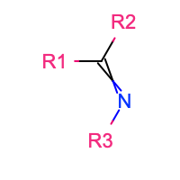
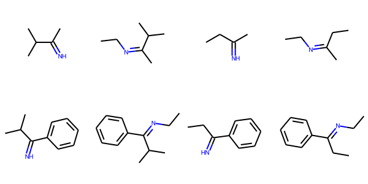

## Constructure

[](https://github.com/SimonBoothroyd/constructure/actions?query=workflow%3ACI)
[](https://lgtm.com/projects/g/SimonBoothroyd/constructure/context:python)
[](https://codecov.io/gh/SimonBoothroyd/constructure)
[](https://opensource.org/licenses/MIT)

The ``constructure`` framework aims to provide utilities for generating a diverse set of molecules from a set of common 
organic scaffolds.

There are currently 153 scaffolds included by default in the framework which can be [viewed here](https://github.com/SimonBoothroyd/constructure/blob/main/docs/scaffolds.png). 
This set were generated based on those functionalities support by [``checkmol``.](https://homepage.univie.ac.at/norbert.haider/cheminf/fgtable.pdf) 

Further, the SMILES patterns of 27 common substituents are [also provided](https://github.com/SimonBoothroyd/constructure/blob/main/docs/substituents.png) 
ready for attachment onto the scaffolds. 

### Installation

The required dependencies for this framework can be installed using `conda`:

```
# If you only have access to RDKit
conda create --name constructure -c conda-forge pydantic rdkit

# If you have access to the OpenEye toolkit
conda create --name constructure -c conda-forge -c openeye pydantic openeye-toolkits

python setup.py develop
```

### Getting Started

In this example we will be generating a small set of imines which have been functionalised with different aryl and
alkyl substituents.



To begin with we will define a general imine scaffold:

```python
# Import the scaffold object which stores the scaffold definition.
from constructure.scaffolds import Scaffold

# Create the imine scaffold.
scaffold = Scaffold(
    smiles="C([R1])([R2])=N([R3])",
    r_groups={
        1: ["hydrogen", "alkyl", "aryl"],
        2: ["hydrogen", "alkyl", "aryl"],
        3: ["hydrogen", "alkyl", "aryl"],
    },
)
```

A scaffold is defined by two main elements: a SMILES pattern which includes the substitutable R groups (denoted as `[RX]`), 
and a dictionary which defines the type of functional group each R group can be substituted with. Each key of the dictionary should 
correspond to a labelled R group defined in the SMILES pattern.

Although we have explicitly defined the imine scaffold here this, and many more, are already defined within the 
framework. These can be accessed from the default scaffolds dictionary:

```python
# Import the default scaffolds dictionary
from constructure.scaffolds import SCAFFOLDS

# Retrieve the imine scaffold.
scaffold = SCAFFOLDS["imine"]
```

Substituents are attached to the scaffold using a constructor object, two of which are provided:
an OpenEye based constructor

```python
from constructure.constructors import OpenEyeConstructor as Constructor
```

and an RDKit based constructor

```python
from constructure.constructors import RDKitConstructor as Constructor
```

depending on which cheminformatics toolkit you have access to.

The list of all possible combinations of a scaffold and a set of substituents are generated using a constructor by:

```python
smiles = Constructor.enumerate_combinations(
    scaffold,
    substituents={
        1: ["[R]C", "[R]c1ccccc1"],
        2: ["[R]C(C)(C)", "[R]CC"],
        3: ["[R][H]", "[R]CC"]
    }
)
```

or, using the built-in substituent SMILES:

```python
# Import the default substituents dictionary.
from constructure.substituents import SUBSTITUENTS

smiles = Constructor.enumerate_combinations(
    scaffold,
    substituents={
        1: [SUBSTITUENTS["methyl"], SUBSTITUENTS["phenyl"]],
        2: [SUBSTITUENTS["isopropyl"], SUBSTITUENTS["ethyl"]],
        3: [SUBSTITUENTS["hydrogen"], SUBSTITUENTS["ethyl"]]
    }
)
```

Here the `substituents` dictionary is used to specify the substituents to consider for the differently labelled R group
attachment points on a scaffold.

The generated structures can then easily be visualised using the built in `smiles_to_image_grid` functions:

```python
# RDkit
from constructure.utilities.rdkit import smiles_to_image_grid
# OpenEye
from constructure.utilities.openeye import smiles_to_image_grid

# Save the 2D structures to an image file.
smiles_to_image_grid(smiles, "imines.png", cols=4)
```

resulting in an image such as



### Copyright

Copyright (c) 2020, Simon Boothroyd
